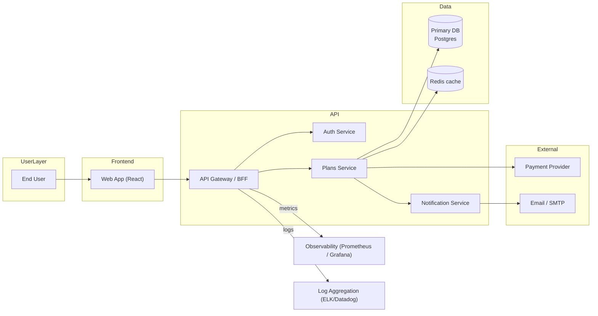

# System Architecture — BoazPlan

**Created:** 2026-02-13
**Owner:** Product / Architecture
**Context:** High-level system architecture to align stakeholders and guide technical design and implementation.

## Purpose
Describe the overall system architecture for BoazPlan — components, responsibilities, integrations, and key non-functional requirements. This is a BMAD-style high-level architecture artifact intended for product, engineering, and operations alignment.

## Scope
- Covers the primary user-facing web application, backend services, data storage, integrations, and deployment boundaries.
- Does NOT include low-level class diagrams, detailed database schemas, or full infra IaC (those belong in technical design / deployment docs).

## Stakeholders
- Product Manager
- Engineering (frontend, backend)
- DevOps / SRE
- QA
- External partners (payment, email)

## Key Architectural Goals
- Simple, modular services to enable incremental delivery (MVP-first)
- Clear API boundaries for frontend/backends and third‑party integrations
- Scalable data stores and stateless services where feasible
- Observability and CI/CD from day one

## High-level diagram

## Components (summary)
- Web App (React): client UI, consumes APIs from API Gateway / BFF.
- API Gateway / BFF: request aggregation, authentication checks, rate-limiting, API composition for frontend.
- Auth Service: issues tokens, handles sessions and SSO hooks (OAuth/OIDC as required).
- Plans Service: core domain service that manages user plans/requests (MVP focus).
- Notification Service: handles outbound emails/notifications.
- Primary DB: relational store (Postgres) for transactional data.
- Redis Cache: short‑lived caches for performance-critical reads.
- External Integrations: payment gateway, email provider, analytics.
- Observability: metrics, logs, traces for production health.

## Data flow (brief)
1. User interacts with Web App → sends request to API Gateway/BFF.
2. Gateway authenticates/authorizes via Auth Service.
3. Gateway routes to Plans Service which reads/writes Primary DB.
4. Plans Service pushes notifications to Notification Service and updates caches.
5. External calls (payments, email) are performed asynchronously where possible.

## Non-functional requirements (NFRs)
- Availability: 99.9% target for core flows
- Latency: API median < 200ms for primary read paths
- Scalability: stateless services behind autoscaling groups
- Security: TLS everywhere, OWASP basics, role-based access controls
- Observability: request tracing, centralized logging, SLO dashboards

## Constraints & Assumptions
- MVP will launch with a single-region deployment
- Use managed cloud services where cost-effective
- Authentication integrates with existing identity provider if available

## Risks & Mitigations
- Risk: Early performance bottlenecks — Mitigation: cache hot reads, add async processing for heavy tasks
- Risk: Third-party outages (email/payment) — Mitigation: retries, circuit-breakers, graceful degradation

## Acceptance criteria (for this architecture artifact)
- Stakeholders reviewed and agree on component boundaries
- Clear API responsibilities documented for frontend vs backend
- NFRs and constraints accepted by engineering

## Next steps (recommended)
1. Create Technical Design docs for `Plans Service` and `Auth` (include API contracts and sequence diagrams).  
2. Add Deployment/Infra doc with minimal IaC for MVP (single-region).  
3. Review with engineering and update iteration 1.

---

*Location:* `_bmad-output/planning-artifacts/system-architecture-BoazPlan-2026-02-13.md`

*If you want, I can now:*
- open this file for edits, or
- produce a Technical Design file next (component-level), or
- generate Epics & Stories from this architecture for the MVP.
