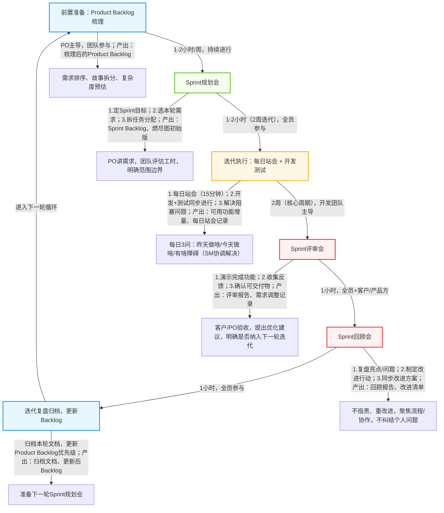

# 完整详细敏捷开发过程（思维导图+流程图）

本文核心：以最主流的 **Scrum 敏捷框架** 为核心，搭配思维导图（梳理整体结构）和开发流程图（拆解执行细节），补充每个节点的核心动作、参与角色和关键产出，让你从零掌握完整敏捷开发过程，可直接用于团队落地。

# 一、敏捷开发整体框架（思维导图形式，可直接复制绘制）

核心逻辑：**思想→角色→流程→支撑→落地**，层层递进，无冗余节点。

## 敏捷开发总框架

- 一、敏捷核心思想（核心准则）
        

    - 小步快跑，快速迭代（迭代周期2-4周，主流2周）

    - 客户协作，优先响应变化（拒绝僵化需求）

    - 交付可用产品（每轮迭代产出可上线增量）

    - 团队自组织，持续改进

- 二、核心角色（3大角色，缺一不可）
        

    - Product Owner（产品负责人）：定需求、排优先级、保价值

    - Scrum Master（敏捷教练）：保流程、扫障碍、促协作

    - Development Team（开发团队）：跨职能（开发/测试/设计）、自组织、保交付

- 三、完整开发流程（Sprint迭代闭环，循环执行）
        

    - 前置准备：产品待办列表（Product Backlog）梳理

    - 迭代启动：Sprint规划会（定目标、选需求、拆任务）

    - 迭代执行：每日站会 + 开发测试一体化

    - 迭代收尾1：Sprint评审会（演示、收反馈）

    - 迭代收尾2：Sprint回顾会（复盘、提改进）

    - 循环：进入下一轮Sprint迭代

- 四、支撑工具与文档
        

    - 核心文档：Product Backlog、Sprint Backlog、用户故事、燃尽图

    - 辅助文档：会议纪要、评审报告、回顾报告、测试用例

    - 常用工具：Jira（任务管理）、Trello（简易跟踪）、飞书/钉钉（协作）

- 五、落地关键要点
        

    - 拒绝“伪敏捷”：不僵化流程，灵活适配团队规模

    - 优先级管理：核心需求先上，次要需求迭代优化

    - 持续沟通：减少文档冗余，优先面对面协作

    - 增量交付：每轮迭代必须产出“可使用”的功能

# 二、敏捷开发详细流程图（步骤拆解，可落地执行）

以 **2周Sprint迭代** 为标准，拆解每个节点的具体动作、参与角色、耗时和产出物，搭配流程图代码（可直接复制生成可视化图表），清晰易懂。

## （一）流程图可视化代码（Mermaid，复制可直接渲染）

## （二）流程图各节点详细拆解（对应上方流程图，逐步骤说明）

### 1. 前置准备：Product Backlog（产品待办列表）梳理

- 参与角色：Product Owner（主导）、Scrum Master、开发团队（参与）

- 耗时：1-2小时/周，持续进行（不是一次性完成）

- 核心动作：
        

    - PO收集所有需求（来自客户、业务、内部团队），用“用户故事”格式描述（作为【角色】，我想要【功能】，以便【价值】）。

    - 团队一起评审需求，拆分复杂需求（比如“支付功能”拆分为“微信支付”“支付宝支付”“退款功能”），评估每个需求的复杂度（用故事点/工时预估）。

    - PO对所有需求排序，优先级从高到低（核心需求→重要需求→次要需求→优化需求），确保团队优先聚焦高价值需求。

- 关键产出：梳理完成的Product Backlog（包含需求标题、描述、优先级、预估工时、负责人）。

### 2. Sprint规划会（迭代启动会）

- 参与角色：全员（PO、SM、开发团队）

- 耗时：1-2小时（2周迭代）；如果是4周迭代，可延长至3小时

- 核心动作（分2步）：
        

    - 第一步：定目标。PO明确本轮Sprint的核心目标（比如“完成用户登录、注册功能，支持手机号+验证码登录”），确保全员达成共识。

    - 第二步：拆任务。团队从Product Backlog中，挑选优先级高、能在本轮迭代完成的需求，拆分成具体可执行的任务（每个任务耗时不超过1天，比如“设计登录页面”“开发验证码接口”“编写登录测试用例”），并分配给对应团队成员。

    - 明确“范围边界”：确定本轮迭代“不做什么”，避免需求蔓延。

- 关键产出：Sprint Backlog（本轮迭代任务清单）、燃尽图初始版（用于跟踪工作量）、Sprint目标确认单。

### 3. 迭代执行：每日站会 + 开发测试一体化

- 参与角色：全员（SM主持）

- 耗时：2周（核心迭代周期）；每日站会固定15分钟（不延长、不闲聊）

- 核心动作：
        

    - 每日站会（每天固定时间，比如早上10点）：每人只说3句话——昨天完成了什么任务、今天要做什么任务、遇到了什么阻塞障碍（比如“接口联调卡住”“需求不明确”）。

    - 障碍解决：SM负责记录所有阻塞问题，当天协调资源解决（比如需求不明确，立即找PO确认；技术难题，协调团队资深成员协助），不耽误迭代进度。

    - 开发测试一体化：开发团队同步进行开发、测试、设计工作，不等到开发全部完成再测试（比如开发完一个接口，立即进行接口测试；设计完一个页面，立即确认适配性），确保问题早发现、早解决。

    - 工作量跟踪：每天更新燃尽图（X轴：日期，Y轴：剩余工作量），直观查看是否符合迭代进度，若滞后，团队协商调整（比如减少次要任务，优先完成核心任务）。

- 关键产出：可用的功能增量（每完成一个需求，确保能正常使用）、每日站会记录（主要记录阻塞问题及解决情况）、更新后的燃尽图。

### 4. Sprint评审会（迭代交付评审）

- 参与角色：全员 + 客户/产品方（关键干系人）

- 耗时：1小时（2周迭代）

- 核心动作：
        

    - 开发团队演示本轮迭代完成的所有功能（现场操作，比如演示登录、注册流程，展示功能效果），说明功能实现情况、是否符合需求预期。

    - 客户/产品方验收功能，提出反馈意见（比如“登录页面按钮位置需要调整”“验证码有效期太短”），PO记录所有反馈，明确哪些反馈需要纳入下一轮迭代、哪些可以后续优化。

    - 全员确认本轮迭代的“可交付物”（即能正常上线、可用的功能增量），若有未完成的需求，PO调整至Product Backlog，重新排序，纳入下一轮迭代。

- 关键产出：Sprint评审报告（包含完成功能列表、未完成功能说明、客户/产品方反馈记录）、需求调整清单。

### 5. Sprint回顾会（迭代复盘改进）

- 参与角色：全员（SM主持）

- 耗时：1小时（2周迭代）

- 核心动作（核心：不指责、重改进）：
       

    - 团队全员发言，梳理本轮迭代“做得好的地方”（比如“每日站会效率高，障碍解决及时”“开发测试同步，减少返工”）。

    - 梳理“做得不好的地方”（比如“需求拆分太粗，导致后期返工”“阻塞问题解决不及时”），不纠结个人责任，聚焦流程、协作上的问题。

    - 针对不好的地方，制定具体的改进行动项（可落地、可量化），明确负责人和完成时间（比如“下次需求拆分，每个任务耗时不超过1天，由PO和开发组长共同审核”）。

    - 同步改进行动方案，确保下一轮迭代优化落实，形成“迭代-复盘-改进-优化”的闭环。

- 关键产出：Sprint回顾报告（包含亮点、问题、改进行动项、负责人、完成时间）。

### 6. 迭代复盘归档，进入下一轮循环

- 参与角色：PO、SM（主导），开发团队（配合）

- 耗时：30分钟-1小时

- 核心动作：
        

    - 归档本轮迭代的所有文档（评审报告、回顾报告、站会记录、燃尽图等），便于后续追溯。

    - PO根据评审会反馈，更新Product Backlog（调整需求优先级、补充新需求、删除无效需求）。

    - 全员休息调整，准备进入下一轮Sprint迭代，重复上述所有流程。

- 关键产出：归档文档包、更新后的Product Backlog。

# 三、补充说明（关键提醒，避免踩坑）

- 流程图可灵活调整：如果团队规模小（3-5人），可简化会议流程（比如Sprint规划会缩短至1小时，回顾会缩短至30分钟），核心是“不僵化、能落地”。

- 燃尽图是核心跟踪工具：建议每天更新，若出现持续滞后，及时调整迭代范围，避免“硬扛”导致交付质量下降。

- 拒绝“伪敏捷”：很多团队只走会议流程，不做增量交付、不响应变化，本质是“形式化敏捷”，核心要抓住“快速迭代、持续改进、交付价值”。

- 工具推荐：新手团队可用Trello（简易跟踪任务），成熟团队可用Jira（完整敏捷流程管理，可自动生成燃尽图），协作可用飞书/钉钉（同步会议记录、文档）。

# 四、快速使用指南

1. 复制本文中的Mermaid流程图代码，粘贴到支持Mermaid的工具（比如ProcessOn、Mermaid Live Editor），即可生成可视化流程图，打印或分享给团队。

2. 按流程图拆解的步骤，结合团队规模，调整每个节点的耗时和动作，直接落地执行。

3. 搭配之前提到的敏捷核心文档（Product Backlog、Sprint Backlog等），形成“流程+文档”的完整落地体系。
> （注：文档部分内容可能由 AI 生成）